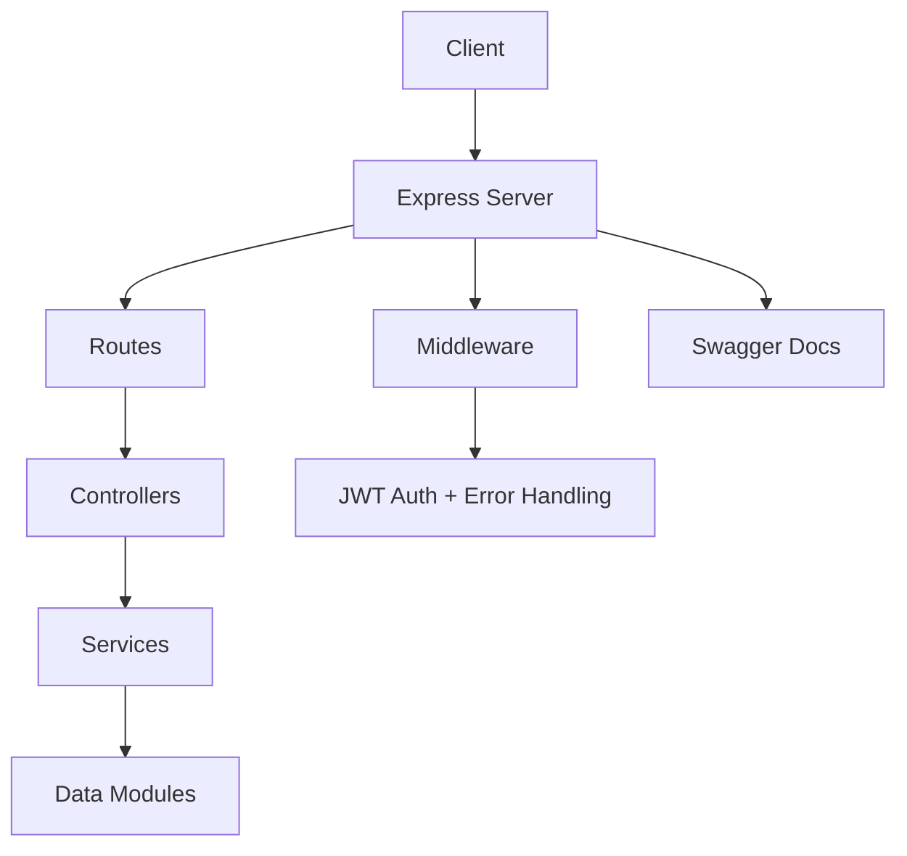

# `Recipes API` 🍴

The **Express Recipes API** is a REST-like service built with Node.js and Express.js.  
It provides endpoints for retrieving culinary recipes, authenticating users, and managing user favorite recipes.

## Table des matières

1. [Key Technologies](#️-key-technologies)
2. [Architecture](#architecture)
3. [Setup and Configuration](#setup-and-configuration)
4. [API Endpoints](#api-endpoints)
5. [Core Components](#core-components)
6. [Business Logic](#business-logic)
7. [User Authentication Service](#user-authentication-service)
8. [User Profile & Favorites Service](#user-profile--favorites-service)
9. [Auteur](#auteur)
10. [Support](#support)

Authentication is handled using JSON Web Tokens (JWT), and password security is implemented using bcrypt. The API utilizes static JSON files for data storage (list.json for recipes, users.js for user data). API documentation is auto-generated and served using express-jsdoc-swagger.

## 🛠️ Key Technologies

- **Backend**: Node.js, Express.js
- **Authentication**:
  - Handled using JSON Web Tokens (JWT)
  - Passwords secured with bcrypt (for password hashing)
- **Data Storage**:
  - `list.json` for recipes
  - `users.js` for user data
- **Documentation**: Swagger UI via `express-jsdoc-swagger` (Swagger UI)
- **Dependencies**:
  - `cors`
  - `body-parser` (implicitly via `express.json()`)
  - `dotenv`
  - `express-jwt`
  - `jsonwebtoken`

## Architecture

The API follows a standard Express.js application structure:

   1. **Server Entry Point (server.js)**: Initializes the Express app, configures middleware, defines routes, sets up Swagger documentation, and starts the server.

   2. **Middleware:** Handles cross-origin resource sharing (CORS), JSON body parsing, JWT authentication (express-jwt), and error handling.

   3. **Routing**: Maps incoming HTTP requests to specific handler functions based on the URL path and HTTP method.

   4. **Data Modules** (list.json, users.js): Provide static data for recipes and users. User passwords in users.js are pre-hashed using bcrypt.

   5. **Authentication**: The /api/login endpoint validates user credentials against users.js data (using bcrypt.compareSync) and issues JWTs upon successful login. Protected routes require a valid JWT in the Authorization: Bearer header.



## Setup and Configuration

### Prerequisites

- Node.js (v16 or higher recommended)  
- Yarn (or npm)  

### Installation

Clone the repository:

   ```bash
   git clone <repository-url>
   cd Express-Recipes-API
   ```

Install dependencies:  

   ```bash
   yarn install
   # or
   npm install
   ```

### Environment Variables

Create a `.env` file in the root directory based on the `.env.example` file:  

```bash
# .env
PORT=3001
JWT_SECRET=OurSuperLongRandomSecretToSignOurJWTgre5ezg4jyt5j4ui64gn56bd4sfs5qe4erg5t5yjh46yu6knsw4q
```

- PORT: The port the server will listen on (defaults to 3001).

> [!IMPORTANT]
> JWT_SECRET: A secret key used to sign and verify JWTs. It is crucial to use a strong, unique secret in production. **The default value is provided for convenience** but should be changed.

### Running the Server

```bash
yarn start
# or
npm start
```

The server will start, typically on <http://localhost:3001> .

### Accéder à la documentation Swagger

Open a browser and go to `http://localhost:3001/api/docs`.

## **API Endpoints**

### **Recettes**

**GET `/`**
   Serves a basic HTML page (index.html) outlining the available API endpoints and example user credentials.

  **Response** : 200 OK: HTML content.

**GET `/api/recipes`**  
   Retrieves a list of all available recipes.

- **Authentication**: None required.
- **Example Response** :

   ```json
   [
     {
       "id": 1,
       "title": "Spaghetti Carbonara",
       "slug": "spaghetti-carbonara",
       "thumbnail": "https://example.com/image.jpg",
       "author": "John Doe",
       "difficulty": "Facile",
       "description": "Délicieuse recette de spaghetti carbonara.",
       "ingredients": ["Spaghetti", "Œufs", "Bacon", "Parmesan"],
       "instructions": ["Faire cuire les spaghetti.", "Mélanger le tout."]
     }
   ]
   ```

**GET `/api/recipes/:idOrSlug`**  
   Retrieves a single recipe by its id (integer) or slug (string).

- **Response :**
    200 OK: A single recipe object.

- **Authentication**: None required.
- **Parameters**:
  - `idOrSlug`: The ID (integer) or the URL-friendly slug (string) of the recipe to retrieve.
- **Example Response** :

   ```json
   {
     "id": 1,
     "title": "Spaghetti Carbonara",
     "slug": "spaghetti-carbonara",
     "author": "John Doe",
     "difficulty": "Facile",
     "description": "Délicieuse recette de spaghetti carbonara."
   }
   ```

- **404 Not Found**: If no recipe matches the provided idOrSlug.

  ```json
  "The recipe with the given ID or Slug was not found."
  ```

---

### **Authentication**

**POST `/api/login`**  
Authenticates a user based on email and password. If successful, returns user information and a JWT.

- **Authentication**: None required.

**Request Body :**

   ```json
   {
     "email": "user@example.com",
     "password": "monSuperPasswordSécurisé"
   }
   ```

   **Example Response :**

   ```json
   {
     "logged": true,
     "pseudo": "username",
     "token": "eyJhbGciOiJIUzI1NiIsInR..."
   }
   ```

- **401 Unauthorized**: Invalid email or password.

  ```json
  {
    "message": "Unauthorized"
  }
  ```

---

### **Favorites (Authentication Required)**

**GET `/api/favorites`**  
   Retrieves the list of favorite recipes for the authenticated user.

- **Authentication**: Required. A valid JWT must be provided in the Authorization: Bearer header.
- **Example Response :**

   ```json
   {
     "favorites": [
       {
         "id": 2,
         "title": "Poulet Basquaise",
         "slug": "poulet-basquaise",
         "author": "Jane Smith",
         "difficulty": "Moyen"
       }
       {
          "id": 5,
          "title": "Tarte Tatin",
          "slug": "tarte-tatin",
          "author": "Alice Dupont",
          "difficulty": "Difficile"
       }
       // ... potentially more favorite recipes
     ]
   }
   ```

- **401 Unauthorized**: If the JWT is missing, invalid, or expired.

  ```json
  {
    "message": "Unauthorized"
  }
  ```

---

## Core Components

### `server.js`

This is the main application file. Its responsibilities include:

- **Initialization**: Creates the Express application instance.

- **Environment Variables**: Loads environment variables using dotenv.

**Middleware Setup**:

- **cors()**: Enables Cross-Origin Resource Sharing.

- **express.json()**: Parses incoming requests with JSON payloads.

- **express.static('public')**: Serves static files (if any) from the public directory.

- **expressJwt()**: Middleware to verify JWTs on protected routes. It checks for a valid token in the Authorization header for routes unless explicitly excluded (like /, /api/login, /api/recipes). The decoded JWT payload (containing userId) is attached to req.user.

- **expressJSDocSwagger()**: Configures and initializes Swagger UI for API documentation, available at /api/docs.

- **Route Handling**: Defines handlers for each API endpoint (/, /api/recipes, /api/recipes/:idOrSlug, /api/login, /api/favorites).

- **Authentication Logic**: The /api/login route handler compares the provided password with the stored hash using bcrypt.compareSync and generates a JWT using jsonwebtoken.sign.

- **Authorization Logic**: The /api/favorites route uses the checkLoggedIn middleware (which verifies req.user exists after expressJwt runs) and then fetches user-specific favorites based on req.user.userId.

- **Error Handling**: Includes middleware to handle UnauthorizedError from expressJwt (invalid tokens) and a final catch-all middleware for 404 Not Found errors or other server errors (500).

- **Server Start**: Starts the HTTP server and listens on the configured port.

`users.js`

- **Purpose**: Acts as a simple, in-memory user database.

- **Structure**: Exports an object containing a users array. Each user object has:

- **id**: Unique user identifier.

- **password**: Hashed password (generated using bcrypt.hashSync in server.js initially and then referenced here).

- **username**: User's display name.

- **color**: A color associated with the user (likely for frontend display).

- **favorites**: An array of recipe IDs that the user has marked as favorite.

- **email**: User's login email.

- **Security**: Passwords are not stored in plaintext. They are hashed using bcrypt before being included in this module. The server.js file demonstrates hashing example passwords, and users.js references these hashed values.

`list.json`

- **Purpose**: Acts as a simple, in-memory recipe database.

- **Structure**: An array of recipe objects. Each recipe object includes:

- **id**: Unique recipe identifier.

- **title**: Recipe title.

- **slug**: URL-friendly version of the title.

- **thumbnail**: URL to an image for the recipe.

- **author**: Recipe creator.

- **difficulty**: Difficulty level (e.g., "Facile", "Moyen").

- **description**: Short description.

- **ingredients**: An array of ingredient objects, each with id, quantity, unit, and name.

- **instructions**: An array of strings representing the cooking steps.

`index.html`

- **Purpose**: A static HTML page served at the root (/) endpoint.

- **Content**: Provides a brief overview of the API endpoints and lists example user credentials (email/password pairs) for testing the /api/login endpoint.

`Authentication Flow`

1. Login: The client sends a POST request to /api/login with the user's email and password in the request body.

2. Verification: The server finds the user by email in users.js. It then uses bcrypt.compareSync to compare the provided password against the stored hashed password.

3. Token Generation: If the credentials are valid, the server generates a JWT using jsonwebtoken.sign. The payload includes the userId. The token is signed with the JWT_SECRET from the environment variables and set to expire (e.g., in 3 hours).

4. Token Response: The server sends a 200 OK response containing { logged: true, pseudo: user.username, token: }.

5. Authenticated Requests: For subsequent requests to protected endpoints (like /api/favorites), the client must include the received JWT in the Authorization header: Authorization: Bearer .

6. Token Validation: The expressJwt middleware intercepts requests to protected routes, extracts the token from the header, and verifies its signature and expiration using the JWT_SECRET. If valid, it decodes the payload and attaches it to req.user. If invalid, it throws an UnauthorizedError.

7. Access Control: Route handlers for protected endpoints can then access req.user (e.g., req.user.userId) to perform actions specific to the authenticated user. The checkLoggedIn middleware ensures req.user exists before proceeding.

`Extending the API`

Based on the README.md suggestions and common API practices:

1. Database Integration: Replace the static JSON files (list.json, users.js) with a proper database (e.g., PostgreSQL, MongoDB) and an ORM/ODM (e.g., Sequelize, Mongoose) for persistent storage and scalability.

2. User Management: Add endpoints for user registration (POST /api/register), profile updates (PUT /api/profile), and password changes.

3. Recipe Management (CRUD): Implement endpoints to create (POST /api/recipes), update (PUT /api/recipes/:id), and delete (DELETE /api/recipes/:id) recipes (requires authentication and authorization).

4. Favorite Management: Add endpoints to add (POST /api/favorites/:recipeId) and remove (DELETE /api/favorites/:recipeId) recipes from a user's favorites list.

5. Pagination: Implement pagination for the GET /api/recipes endpoint using query parameters (e.g., ?page=1&limit=10) to handle large numbers of recipes efficiently.

6. Input Validation: Add robust input validation (e.g., using libraries like joi or express-validator) to sanitize and validate data received in request bodies and parameters.

7. Testing: Implement unit and integration tests (e.g., using Jest, Mocha, Supertest) to ensure API reliability and prevent regressions.

8. Refined Error Handling: Provide more specific error messages and status codes for different failure scenarios.

## Business Logic

### Recipe Catalog Service

#### Purpose

Provides access to the collection of available culinary recipes within the application.

Solves the business need for users to browse, discover, and view details of recipes.

Represents the "Recipe" domain concept.

#### Key Responsibilities

Provides a complete list of all available recipes.

Allows retrieval of detailed information for a single recipe using a unique identifier (either its ID or its user-friendly "slug").

#### Workflows / Use Cases

**Browse All Recipes:**

**Trigger**: User navigates to the main recipe listing section of the application (e.g., sends a GET request to /api/recipes).

**Steps**: The service retrieves all recipe records from the data source.

**Outcome**: A list containing summary information for all recipes is returned to the user interface.

**View Specific Recipe Details:**

**Trigger**: User selects a specific recipe from a list or navigates directly via a link (e.g., sends a GET request to /api/recipes/crepes-raffinees or /api/recipes/12345).

**Steps**: The service uses the provided ID or slug to find the corresponding recipe in the data source.

**Outcome**: The full details of the requested recipe (including ingredients, instructions, etc.) are returned, or a "Not Found" error if the identifier is invalid.

#### Inputs and Outputs

**Inputs**: Optionally, a recipe ID (integer) or recipe slug (string) for specific lookups.

**Outputs**: An array of recipe objects (for the list view) or a single recipe object (for the detail view). Returns a 404 error if a specific recipe is not found.

#### Dependencies

**list.json**: The static data source containing all recipe details.

##### Business Rules & Constraints

Each recipe must have a unique id.

Each recipe should have a unique, URL-friendly slug for user-friendly access.

Recipes contain standard fields like title, description, difficulty, author, ingredients, and instructions.

##### Design Considerations

The current implementation uses a static JSON file (list.json) as the data source. This is simple for small, unchanging datasets but does not scale and requires code deployment for any recipe updates.

Using both ID and slug for lookup provides flexibility but requires careful handling to ensure uniqueness and consistency.

## User Authentication Service

### Purpose Authentication Service

Verifies the identity of users attempting to access the application.

Solves the business need to protect user-specific data and actions (like managing favorites) by ensuring only legitimate users can access them.

Represents the "User Session" and "Authentication" domain concepts.

### Key Responsibilities Authentication Service

Authenticates users based on their registered email and password.

Issues secure access tokens (JWT) upon successful authentication, allowing users to access protected resources.

Rejects login attempts with invalid credentials.

### Workflows / Use Cases Authentication Service

**User Login:**

Trigger: User submits their email and password via a login form (e.g., sends a POST request to /api/login).

Steps:

1. Receive email and password.
2. Find a user record matching the provided email.
3. Securely compare the provided password against the stored hashed password using bcrypt.
4. If credentials match, generate a time-limited JSON Web Token (JWT) containing the user's ID.
5. If credentials do not match or the user doesn't exist, prepare an error response. Outcome: On success, returns a confirmation (logged: true), the user's pseudo, and the JWT. On failure, returns a 401 Unauthorized status.

#### Inputs and Outputs Authentication Service

Inputs: User's email and password.

Outputs: On successful login: An object containing { logged: true, pseudo: string, token: string }. On failed login: A 401 Unauthorized error response.

#### Dependencies Authentication Service

**users.js**: The static data source containing user credentials (including hashed passwords).

**bcrypt**: Library used for secure password comparison.

**jsonwebtoken**: Library used for creating JWTs.

**express-jwt**: Middleware used to verify JWTs on incoming requests for protected routes.

#### Business Rules & Constraints Authentication Service

Business Rules & Constraints
Users are identified by their unique email address.

Passwords must be securely compared against stored hashes; plain text passwords are never stored.

Generated JWTs expire after a predefined duration (currently 3 hours).

The JWT contains the userId to identify the logged-in user in subsequent requests.

The JWT audience is set to api.users, potentially for access control scoping.

#### Design Considerations Authentication Service

User data is currently hardcoded in users.js, including pre-hashed passwords. This is suitable only for demonstration or testing, not production. Features like user registration, password updates, or password recovery are not implemented.

Using JWT enables stateless authentication, meaning the server doesn't need to store session state for logged-in users.

- Password hashing uses bcrypt with a cost factor of 10, which is a standard security practice.

## User Profile & Favorites Service

### Purpose (User Profile)

Allows authenticated users to manage their personal preferences, specifically their list of favorite recipes.

Solves the business need for users to easily save and access recipes they frequently use or like.

Represents the "User Preferences" or "Favorites" domain concept.

### Key Responsibilities (User Profile)

- Retrieves the list of recipes marked as favorites by the currently logged-in user.
- Ensures only authenticated users can access their own favorites list.

### Workflows / Use Cases (User Profile)

#### Fetch Favorite Recipes

**Trigger:**  
An authenticated user navigates to their "Favorites" section (e.g., sends a GET request to `/api/favorites` with a valid JWT in the Authorization header).

**Steps:**

1. The system verifies the JWT to confirm the user is authenticated and extracts their `userId`.  
2. The service looks up the user's data using the `userId`.  
3. It retrieves the list of favorite recipe IDs associated with that user.  
4. It filters the main recipe catalog to find the full details of recipes matching those IDs.【20**

**Outcome:**  
Returns a list containing the full recipe objects marked as favorites by the user. If the user is not authenticated or the token is invalid, a 401 Unauthorized error is returned.【20**

### Inputs and Outputs (User Profile)

**Inputs:**  
A valid JWT (passed via Authorization header) identifying the logged-in user.

**Outputs:**  
An object containing a `favorites` key, whose value is an array of the user's favorite recipe objects. Returns a 401 Unauthorized error if the JWT is missing or invalid.

### Dependencies (User Profile)

- `users.js`: Data source for user information, including the list of favorite recipe IDs per user.  
- `list.json`: Data source for retrieving the full details of the favorite recipes.  
- `express-jwt` / Custom JWT Middleware: For validating the user's token and extracting their `userId`.  

### Business Rules & Constraints (User Profile)

- Users must be authenticated (provide a valid JWT) to view their favorites.  
- A user can only view their own list of favorites.  
- The list of favorites is stored as a collection of recipe IDs associated with the user's profile.  

### Design Considerations (User Profile)

- The current implementation only supports retrieving favorites; adding/removing favorites is not implemented in the provided code.  
- Storing favorites as an array of IDs in the user object (in `users.js`) is simple but might become inefficient if the number of users or recipes grows significantly, as fetching favorites requires filtering the entire recipe list.  
- Relies on the user data being available in memory via `users.js`.  

---

## **Auteur**

👤 **Yan Berdin**

- Website: [@yanberdin.com](<https://www.yanberdin.com>)
- Github: [@Yan{GitHub}](https://github.com/YanBerdin)
- LinkedIn: [@Yan{LinkedIn}](https://www.linkedin.com/in/yan-berdin)

---

## **Support**

Give a ⭐️ if this project helped you!
